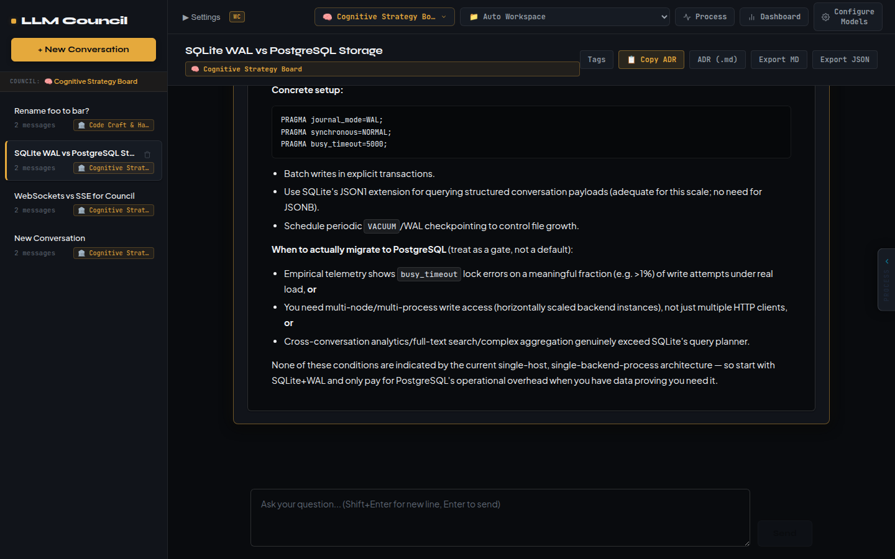
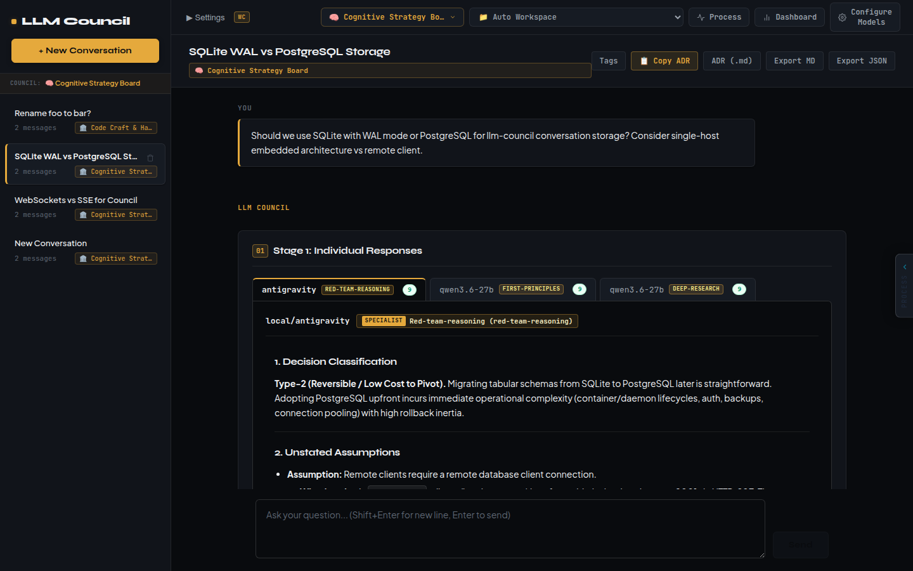
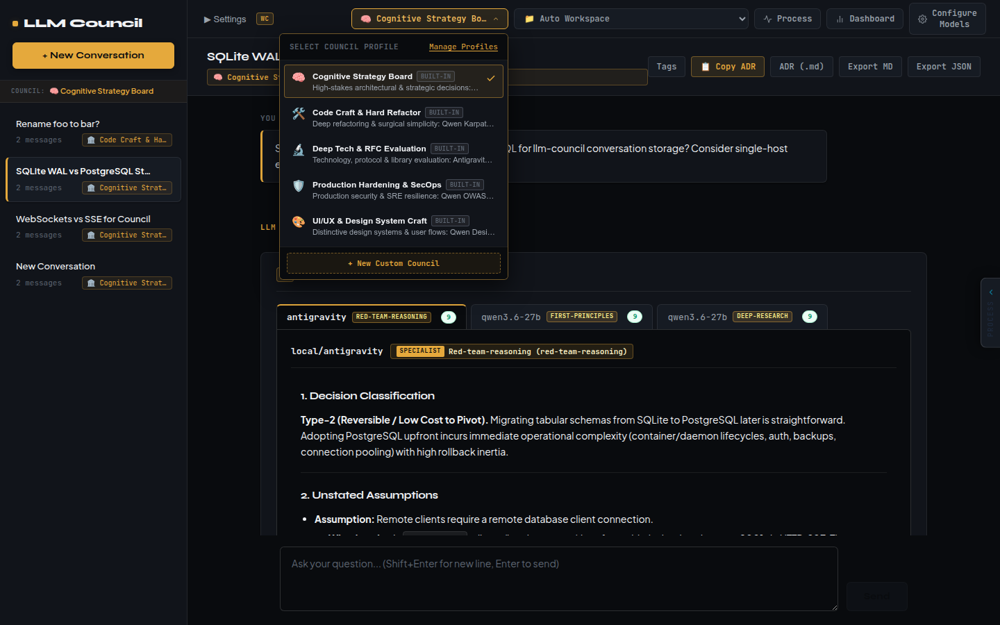
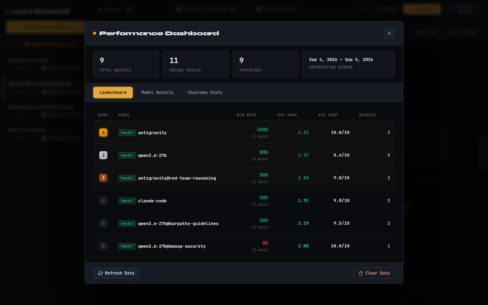
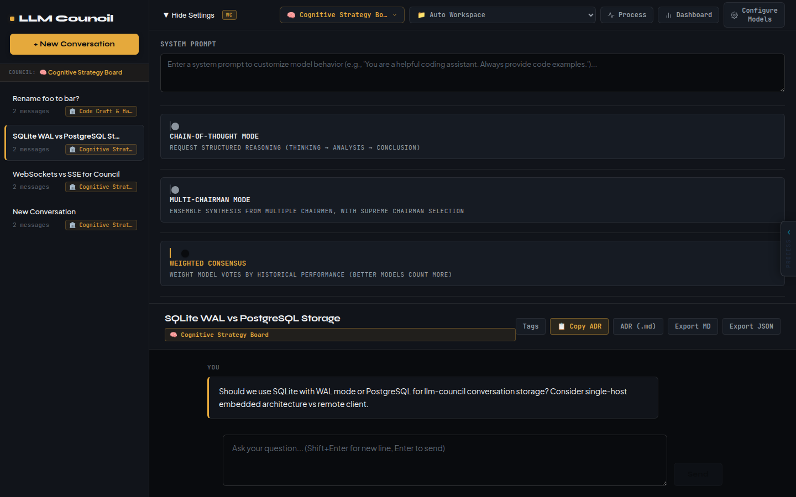

# LLM Council MCP

<p align="center">
  
</p>

<p align="center">
  <b>A Multi-Model Deliberation Engine & Autonomous MCP Oracle for Claude Code, Antigravity, and Qwen</b>
</p>

<p align="center">
  
  
  
  
  
</p>

---

## 🏛️ Provenance & What This Fork Changes

> **Fork Lineage:**  
> This project is an advanced, production-hardened fork of **[Andrej Karpathy's llm-council](https://github.com/karpathy/llm-council)** (expanded from **[az9713/llm-council](https://github.com/az9713/llm-council)**).

Karpathy built the original `llm-council` as a fun "Saturday vibe-hack" — a lightweight web script to compare commercial frontier LLMs side-by-side using OpenRouter. 

**LLM Council MCP transforms that initial prototype into an enterprise deliberation engine and a headless consensus oracle for autonomous AI agents.** Instead of humans manually querying a browser, agents like **Claude Code** and **Google Antigravity** call the council programmatically via the **Model Context Protocol (MCP)** whenever they face irreversible, high-stakes (Type-1) architectural dilemmas.

---

## ⚡ Original vs. LLM Council MCP: Feature Comparison

| Capability | Karpathy Original (`llm-council`) | LLM Council MCP (This Fork) |
| :--- | :--- | :--- |
| **Primary Consumer** | Humans in a Web Browser | **Autonomous AI Coding Agents (MCP)** + Humans via Web UI |
| **Agent Interface** | ❌ None (Web UI only) | **Native FastMCP Server (`mcp/`)** with structured ADR generation |
| **Model Infrastructure** | Cloud-only via OpenRouter | **Hybrid:** Cloud (OpenRouter) + Local vLLM (`local/qwen3.6-27b`) + Host CLI Shims (`local/claude-code`, `local/antigravity`) |
| **Model Specialization** | Generic system prompts | **Domain Skill Injection:** Models decorated with `@red-team-reasoning`, `@first-principles`, `@karpathy-guidelines`, etc. |
| **Board Profiles** | Single static list of models | **5 Specialized Domain Boards:** Cognitive Strategy, Code Craft, Deep Tech, SecOps, and UI/UX |
| **Consensus Mechanics** | Linear 3-stage execution | **Early Consensus Bypass, Weighted Consensus (by win rate), Multi-Chairman, and Adversarial Validation** |
| **Debate Protocol** | ❌ None | **Multi-round structured debate:** Position → Critique → Rebuttal → Chairman Judgment |
| **Decision Output** | Unbounded text transcript | **Strict ≤150-word Markdown ADR** (Verdict, Confidence, Recommendation, Dissenting Risk) |
| **Telemetry & Metrics** | ❌ None | **Empirical Performance Dashboard:** Elo win-rates, peer evaluation stats, and token economics |
| **Context Ingestion** | ❌ Manual copy-paste | **Automated Local Workspace & GitHub Repository context resolution** |
| **Technology Scouting** | ❌ None (Hallucinated from weights) | **Autonomous Research Engine:** Live GitHub repo telemetry + DuckDuckGo Lite search + local skills discovery |
| **Deployment** | Local scripts with hardcoded configs | **12-Factor Docker Compose stack** with zero leaked host credentials via `.env` |

---

## 📸 Visual Tour of New Capabilities

### 1. Stage 1: Domain-Specialized Independent Responses
Models are not treated as generic chatbots. Each seat operates with an injected domain skill and provides explicit confidence calibration and structured reasoning.

<p align="center">
  
</p>

### 2. Specialized Council Boards
Switch between dedicated expert boards with a single click or specify `council_id` in MCP tool calls:
- 🧠 **`cognitive-strategy`:** High-stakes architectural & strategic trade-offs (Red Team + First Principles + Deep Research).
- 🛠️ **`code-craft`:** Deep refactoring, diff-risk minimization & surgical simplicity.
- 🔬 **`deep-tech`:** Protocol RFCs, performance limits, and dependency audits.
- 🛡️ **`sec-ops`:** Production security, OWASP audits, and SRE resilience.
- 🎨 **`frontend-craft`:** Distinctive design systems, UI/UX DNA, and client workflows.

<p align="center">
  
</p>

### 3. Empirical Performance Dashboard
Track which models and skills provide the most accurate evaluations through peer review. Features historical win rates, peer agreement metrics, and Chairman synthesis quality.

<p align="center">
  
</p>

### 4. Advanced Consensus Modes & Settings
Configure early-exit consensus, Chain-of-Thought reasoning, adversarial reviews, and weighted voting directly from the settings drawer:

<p align="center">
  
</p>

---

## 🔌 Using as an MCP Oracle (Claude Code & Antigravity)

The repository bundles a standalone FastMCP server in [`mcp/`](mcp/) that lets AI coding assistants deliberate before committing dangerous or irreversible changes.

### The 4-Point Gating Guardrail
To prevent agents from lazily delegating routine tasks, `ask_council` enforces a strict gating checklist:
1. **Type-1 Decision:** Must be irreversible or carry a high rollback cost (justified in `type1_rationale`).
2. **Genuine Uncertainty:** The agent must have attempted solo reasoning first and encountered a real conflict or unknown.
3. **High Cost of Error:** The cost of picking the wrong path must exceed ~35s + API token cost.
4. **User Has Not Decided:** Council informs open choices; it never overrides an explicit user directive.

*Trivial or unjustified queries are rejected in milliseconds with `## Verdict: Gating Rejection` without triggering backend LLM calls.*

### Output Schema (Bounded ≤150-Word ADR)

Calls to `ask_council` return a structured, high-density Markdown Architectural Decision Record:

```markdown
## Verdict: Use SQLite with WAL mode for local conversation storage
**Confidence:** Consensus — 3 models evaluated (top ranked: local/antigravity@red-team-reasoning)
**Recommendation:** Deploy SQLite with PRAGMA journal_mode=WAL and PRAGMA busy_timeout=5000. It eliminates network daemon failure modes and delivers near-zero operational complexity.
**Dissenting risk:** If write contention exceeds 1% busy timeouts under horizontal multi-process scale, pivot to PostgreSQL.
```

---

## 🚀 Quick Setup

> **Using an AI coding agent?** Tell it: *"Clone https://github.com/alkrcaaa/llm-council-mcp
> and install it by following `AGENT_INSTALL.md`."* That file also covers reporting issues
> and contributing via pull requests.

### Prerequisites

- [Docker](https://docs.docker.com/get-docker/) with Compose v2 (`docker compose version` works)
- An [OpenRouter API key](https://openrouter.ai/keys) for cloud models (models ending in `:free` cost $0)

### 1. Install & start (one command)

```bash
git clone https://github.com/alkrcaaa/llm-council-mcp.git llm-council
cd llm-council
./setup.sh
```

On the first run `setup.sh`:

1. creates `.env` from `.env.example` and asks for your OpenRouter key,
2. generates a random admin password and `JWT_SECRET`,
3. builds and starts the backend + frontend containers,
4. prints the URL and login credentials.

Open **http://localhost:5173** and sign in with the printed credentials (username `admin`). Change the password from the UI after the first login.

| Command | What it does |
| :--- | :--- |
| `./setup.sh` | Start (or rebuild after `git pull`). Safe to re-run; existing secrets are kept |
| `./setup.sh stop` | Stop the containers. Conversations and settings stay in the `council-data` volume |
| `./setup.sh logs` | Follow container logs |
| `./setup.sh shims` | Run your Claude Code / Antigravity CLI as council seats (see below) |

### 2. Set up your models

The built-in boards are tuned for the author's machine: they use host-side agent shims
(`local/claude-code`, `local/antigravity`), a local vLLM server (`local/qwen3.6-27b`) and
API-key providers (`custom/gemini-*`, `custom/groq`). **On a fresh install those seats
won't answer until you configure them.** The quickest path:

1. Open **Configure Models** in the UI.
2. Create your own council (or edit a copy of a built-in one) using OpenRouter model IDs,
   e.g. `google/gemma-4-31b-it:free`, `nvidia/nemotron-3-super-120b-a12b:free`. At least 2 seats
   are required. The free lineup changes often; see the current list at
   [openrouter.ai/models?q=free](https://openrouter.ai/models?q=free).
3. Optional: under **Model Studio & Providers**, add other OpenAI-compatible endpoints
   (Ollama, LM Studio, vLLM, Groq, Gemini, DeepSeek, ...) and use them as seats.

Free OpenRouter models are rate-limited, so expect occasional `429` errors on busy models;
the council continues with whichever seats answered.

### 3. Optional: bring the built-in boards online

Each built-in seat type can be activated on your machine. Enable whichever you have;
seats you don't enable simply fail and the council continues with the rest.

#### Claude Code & Antigravity seats (`local/claude-code`, `local/antigravity`)

Small host-side bridges in [`infra/local-models/`](infra/local-models/) turn a logged-in CLI
into an OpenAI-compatible endpoint the backend container can call. They must run on the host
(not in Docker) because they use your CLI login. Each request is a real CLI call on your
account, and the CLIs run in restricted/sandboxed mode (no tools, no file writes).

1. Install and log in to the CLI(s) you have:
   [Claude Code](https://docs.claude.com/en/docs/claude-code) (`claude`, run it once to log in)
   and/or Google Antigravity (`agy`).
2. Run:
   ```bash
   ./setup.sh shims
   ```
   It detects which CLIs are installed, generates a per-shim secret in `.env`, and
   - **Linux (systemd):** installs and starts user services
     `llm-council-claude-code-shim` / `llm-council-antigravity-shim`, bound to the Docker
     bridge address so only containers (not your LAN) can reach them. Logs:
     `journalctl --user -u llm-council-claude-code-shim -f`.
   - **macOS / no systemd:** prints the command to run each shim in a terminal.
3. It restarts the backend so it picks up the secrets. The Claude seats should now answer.

To remove them: `systemctl --user disable --now llm-council-claude-code-shim llm-council-antigravity-shim`
and delete the unit files in `~/.config/systemd/user/`.

#### Local model seat (`local/qwen3.6-27b`)

Point it at any OpenAI-compatible server in `.env`, then re-run `./setup.sh`:

```bash
# vLLM (the author's setup)
QWEN_BASE_URL=http://host.docker.internal:8002/v1
QWEN_MODEL_ID=/models/qwen3.6-27b

# or Ollama (on Linux start it with OLLAMA_HOST=0.0.0.0 so containers can reach it)
QWEN_BASE_URL=http://host.docker.internal:11434/v1
QWEN_MODEL_ID=qwen3:8b
```

#### Gemini & Groq seats (`custom/gemini-3-6-flash`, `custom/groq`)

Add them under **Configure Models → Model Studio & Providers** with your own API keys
(both have free tiers). The seat ID is derived from the friendly name, so name them exactly
**`Gemini 3.6 Flash`** (→ `custom/gemini-3-6-flash`) and **`Groq`** (→ `custom/groq`) for
the built-in boards to pick them up.

### Configuration reference

All settings live in `.env` (see [`.env.example`](.env.example) for every option):

| Variable | Purpose |
| :--- | :--- |
| `OPENROUTER_API_KEY` | Cloud models via OpenRouter |
| `ADMIN_USERNAME` / `ADMIN_PASSWORD` | Initial web UI login |
| `JWT_SECRET` | Signs login tokens; required while `AUTH_ENABLED=true` |
| `BACKEND_BIND_HOST` / `FRONTEND_BIND_HOST` | `127.0.0.1` (default, this machine only) or `0.0.0.0` to open the UI from your LAN |
| `SKILLS_DIR` | Folder of skill prompts for `model@skill` seats (default `./skills`) |
| `QWEN_*`, `*_SHIM_*` | Optional local model server and host CLI shims |

After editing `.env`, run `./setup.sh` again to apply it.

> Opening the UI to your LAN? Keep `AUTH_ENABLED=true`: the API spends your API credits.

### 3. Connect MCP to Your Agents

```bash
cd mcp
bash install.sh
cd ..
```

**Claude Code (`~/.claude.json`):**
```json
{
  "mcpServers": {
    "llm-council": {
      "command": "/absolute/path/to/llm-council-mcp/mcp/.venv/bin/python",
      "args": ["/absolute/path/to/llm-council-mcp/mcp/server.py"],
      "timeout": 140000
    }
  }
}
```

**Antigravity (`~/.gemini/config/mcp_config.json`):**
```json
{
  "mcpServers": {
    "llm-council": {
      "command": "/absolute/path/to/llm-council-mcp/mcp/.venv/bin/python",
      "args": ["/absolute/path/to/llm-council-mcp/mcp/server.py"],
      "timeout": 140000
    }
  }
}
```

---

## 🛠️ Tech Stack

- **Core Engine:** FastAPI, Async HTTPX, Pydantic, uv
- **Protocol:** FastMCP (Model Context Protocol stdio transport)
- **Frontend:** React 18, Vite, Custom Design System, React Markdown
- **Models:** OpenRouter, vLLM (Qwen 2.5/3.6), Local Host Shims (Claude Code CLI, Antigravity CLI)
- **Containerization:** Docker & Docker Compose

---

## 📜 Acknowledgments & License

- Original concept and initial implementation by **[Andrej Karpathy](https://github.com/karpathy/llm-council)**
- Extended multi-feature baseline by **[az9713](https://github.com/az9713/llm-council)**
- Released under the **MIT License**.
